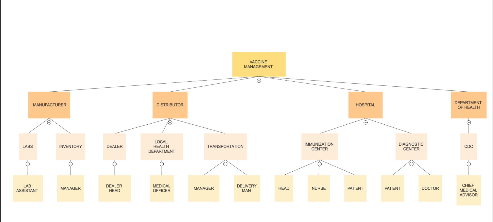

# AED_Final_Project_2022

# Project Name : VACCINE DISTRIBUTION SYSTEM

# Project group :

Karthik Sunil - 002910070

Freya Dsouza - 002756302

Soham Shah - 002703848

# Topic Description

The goal of this project is to design, develop, and implement a vaccine distribution system that will allow real-time access to vaccine availability at the federal, state, and local levels as well as proper vaccination of all patients.

The following is our application with all the entities, organization and roles defined.

Entities: Hospital, Health Department, Distributor and Manufacturer.

Organization: Local Health Department, Center of Disease Control, Center of Immunization, Center of diagnostics, Transportation, Lab, Inventory and Dealer.

Roles: Medical Officer, CDC Officer, Center Head, Nurse, Patient, Doctor, Transportation Manager, Delivery Man, Lab Assistant, Inventory Manager and Dealer Head

# Flow of Project
Ordering Vaccines:
    1. In order to stock up, the hospital administrator will ask the dealer for work.
    2. Dealer will submit a work request for the local health department's medical officer's approval.
    3. The CDC administrator will check to see if the vaccination is available, and if it is, he or she will ask the hospital to take care of the payment.
    4. The hospital will pay the dealer's head.
    5. The Dealer Head will ask the Manufacturer to start producing vaccines.
    6. The manufacturer will then provide the vaccination to a delivery manager.
    7. The delivery person will then receive it from the delivery manager.
    8. The vaccine will subsequently be delivered to the hospital by a delivery person.

Immunization of the Patient:
    1. The patient will visit the vaccination clinic to receive the shot.
    2. The vaccination center will ask a doctor to examine the patient's vital signs.
    3. The nurse enters the picture and gives the patient the vaccine if the doctor gives the go-ahead.     

Registering New vaccination:
    1. If the test is successful, the CDC director will give the inventory manager a fresh set of vaccines to store.
    2. The inventory manager will hand the set over to the lab assistant for examination.
    3. After passing, it will be put back into storage with the inventory manager, who will then let the CDC head know about its status.

Returning the extra vaccine:
    1. If the hospital has surplus vaccinations, the CDC director will urge them to return them.
    2. The delivery manager will assign the delivery man to receive it from the hospital.
    3. The delivery person will hand it off to the inventory manager, who will keep all the vaccinations that were returned.
    4. The inventory manager will inform the CDC of the number of vaccinations that have been returned.    

   
